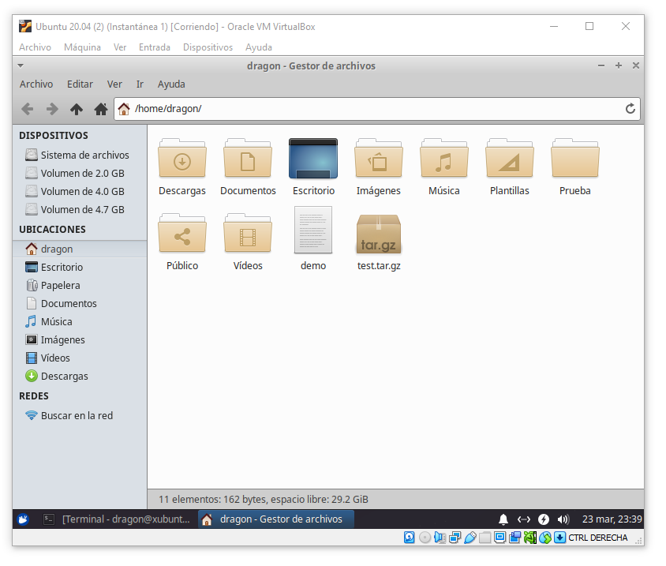
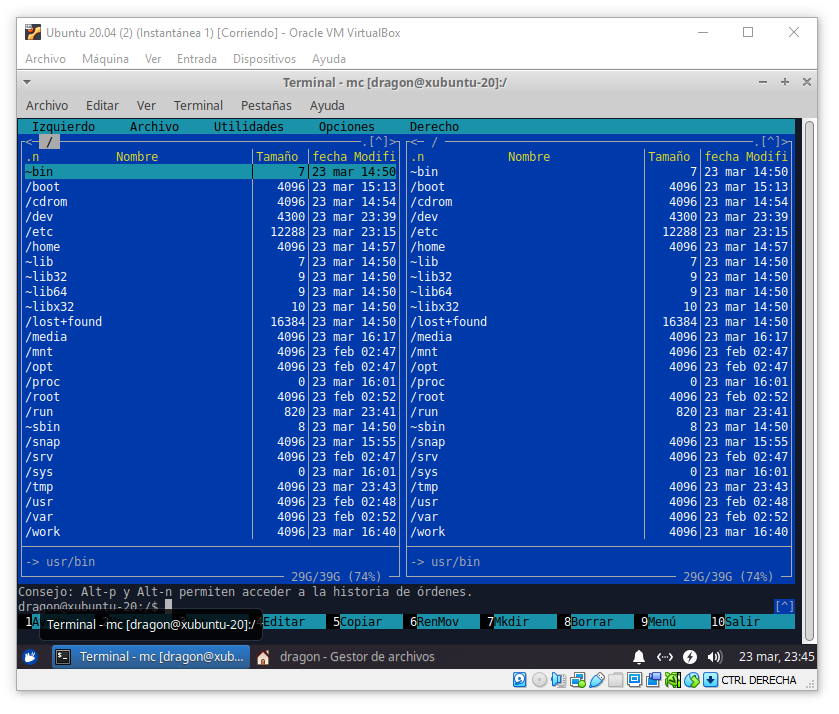

# Archivos y Permisos

---

## Rutas Relativas y Absolutas

Una ruta del sistema de archivos se establece como la concatenación de las carpetas comenzando por `/`, la cual es la carpeta raíz, seguido del nombre de la carpeta y separaciones dadas por diagonales (`/`).

Por ejemplo, la ruta `/home/roboto/Música` será la ruta de la carpeta de música ubicada en la carpeta principal del usuario.

A las rutas que parten de `/` se les conoce como **rutas absolutas**. Si una ruta es especificada sin partir de `/`, si se parte explícitamente de `./`, por `../`, por la ruta `~` o la ruta `~<username>`, significará que la ruta será calculada a partir de la ruta actual, la cual puede consultarse con el comando `pwd`. A las rutas que no son absolutas se les consideran **rutas relativas**.

Por ejemplo, la ruta `Escritorio/Proyectos` será la ruta calculada a partir de la ruta actual. En la siguiente tabla se reunen varios ejemplos de rutas absolutas y relativas.

Ruta | Tipo | Descripción
--- | --- | ---
`/home/roboto/Escritorio` | `absoluta` | La carpeta del escritorio del usuario `roboto`
`Proyectos/Enero/pendientes` | `relativa` | La carpeta proyectos relativa a la ruta actual
`/etc/apache2/enabled-sites` | `absoluta` | La carpeta de configuraciones de servidores de `Apache 2` 
`./scripts/src` | Una carpeta de *scripts* relativa al directorio actual
`../lib/common` | Una carpeta `lib` ubicada una carpeta anterior a la carpeta actual y luego a `common` dentro de lib.
`~ana/public/photos` | Una carpeta de fotos públicas ubicada en la carpeta principal del usuario `ana`

## Grupos y Usuarios

En Linux, la administración y uso del sistema se da mediante usuarios y grupos. Los usuarios representan a usuarios del sistema, mientras los grupos representan entidades o agrupaciones del sistema.

Por ejemplo, podríamos tener un usuario por cada empleado o persona que use la máquina Linux. Sin embargo, podríamos tener grupos que determinen departamentos de nuestra empresa, organizaciones, conjuntos de usuarios, etc.

Podemos crear nuevos grupos mediante `groupadd` y nuevos usuarios mediante `useradd`.

En configuraciones más avanzadas podremos usar a los grupos para darles permisos especiales a todos los que pertenezcan a ese grupo. Aunque generalmente se usan para permitirles acceso a todos los miembros de ese grupo. Por ejemplo, al diseñar carpetas compartidas para un conjunto de usuarios.

Los usuarios pueden tener más de un grupo. Podemos agregarle grupos a un usuario mediante `usermod -a -G <groups> <username>` y podemos quitar a un usuario de un grupo mediante `gpasswd -d <username> <group>`.

## Autoría de Archivos y Carpetas

Los archivos y carpetas tienen un comportamiento similar en Linux, podríamos decir que las carpetas son archivos especiales que contienen a otros archivos y carpetas. Entonces, dichos archivos y carpetas en general podemos considerarlos rutas o recursos en el contexto del sistema de archivos.

Cada archivo o carpeta poseerá un único usuario propietario (`U - User`) y un único grupo propietario (`G - Group`). Si un usuario coincide con el usuario propietario, entonces se le darán los permisos especificados para el usuario propietario. Si por el contrario un usuario no es el usuario propietario y accede al recurso, se determinará si el usuario pertenece al grupo propietario del recurso y se le darán los permisos marcados hacía el grupo. En otro caso, el usuario será considerado un usuario más que intenta acceder a un recurso y no es ni el usuario propietario, ni parte del grupo propietario. Por lo que se le darán los permisos marcados para otros usuarios que intentan acceder al recurso.

Cuándo un recuso es creado, se asignará al usuario propietario como el usuario actual que creó el recurso y el grupo principal de este, o el grupo específicado por la carpeta (si está activa la opció *SGID* que se verá más adelante).

Podemos cambiar el usuario propietario y el grupo propietario mediante el comando `chown <username>:<group> <resource>`.

    # Cambiar el usuario propietario de un recurso

    chown <username> <resource>

    # Cambiar el grupo propietario de un recurso

    chown :<group> <resource>

    # Cambiar el usuario y grupo propietario de un recurso

    chown <username>:<group> <resource>

* **Nota:** Si el usuario actual es el usuario propietario podrá cambiar el propietario sin mayor problema, cediendo la autoría del recurso, sin embargo, cualquier administrador podrá cambiar el propietario de un recurso en cualquier momento usando `sudo`.

## Niveles de Acceso

Cada archivo o carpeta tiene determinados una serie permimos en tres niveles llamados **Niveles de Acceso `UGO`**. Estos niveles de acceso determinan que permisos tendrá el usuario propietario (`U - User`), los miembros del grupo propietario (`G - Group`) y otros usuarios (`O - Others`).

Cada nivel de acceso tendrá tres modos de acceso: `r` (`r - read / Lectura`), `w` (`W - write / escritura`) y `x` (`x - execute / ejecución`).

Cada recurso podría ser leído, escrito (creado o modificado) o ejecutado (en el caso de programas y scripts). Sin estos permisos, el usuario en el nivel de acceso dado, no podrá realizar actividades de lectura, escritura o ejecución y se evitará el mal uso de los recusos.

La siguiente tabla resume los niveles de acceso y los tipos de permisos.

Nivel | Modos | Descripción
--- | --- | ---
`u` | `rwx` | Establece el acceso para el usuario propietario
`g` | `rwx` | Establece el acceso para los usuarios del grupo propietario
`o` | `rwx` | Establece el acceso para otros usuarios

Así, si se desea otorgar o quitar permisos sobre un recurso, se deberán especificar los accesos en los tres niveles, generalmente al resultado se le conoce como la cadena de permisos y está compuesta por los permisos `ugo` y se ve como `rwxrwxrwx` dónde los primeros tres modos son para `u` (el usuario propietario), los siguientes tres modos son para `g` (el grupo propietario) y los últimos tres modos son para `o` (otros usuarios). 

La siguiente tabla muestra algunos ejemplos de cadenas posibles.

Cadena de Permisos | `u` | `g` | `o` | Descripción
--- | --- | --- | --- | ---
`r--r--r--` | `r--` | `r--` | `r--` | El usuario propietario puede leer el recurso, los usuarios del grupo propietario pueden leer el recurso y otros usuarios pueden leer el recurso.
`rwxr-x---` | `rwx` | `r-x` | `---` | El usuario propietario puede leer, escribir y ejecutar el recurso, los usuarios del grupo propietario pueden leer y ejecutar el recurso y otros usuarios no tienen acceso al recurso.
`r--rw---x` | `r--` | `rw-` | `--x` | El usuario propietario puede leer el recurso, los usuarios del grupo propietario pueden leer y escribir el recurso y otros usuarios pueden ejecutar el recurso.

## Modos de Acceso

Ya hemos visto que en cada nivel de acceso se otorgará un modo de acceso que es la combinación entre lectura (`r`), escritura (`w`) y ejecución (`x`). Esta combinación se le conoce como **Modo de Acceso** o permiso de acceso en las tres modalidades.

Los modos de acceso están relacionadas a un bit binario. Por ejemplo, `r` es el tercer bit o `100`, `w` es el segundo bit o `010` y `x` es el primer bit o `001`. En decimal, estos bits representan los valores de `r -> 100 -> 4`, `w -> 010 -> 2` y `x -> 001 -> 1`.

El modo de acceso está determinado por la suma de las modalidades, por ejemplo un permiso de lectura y escritura (`rw-`) será la suma de los bits `110` o el número `6`. Otro ejemplo sería el modo de lectura y ejecución (`r-x`) cuya suma de bits es `101` o el número `5`.

La siguiente tabla resume todos los posibles modos de acceso en su forma simbólica, en la suma de bits y en el valor numérico.

Modo Simbólico | Modo en Bits | Modo en Número
--- | --- | ---
`---` | `000` | `0`
`--x` | `001` | `1`
`-w-` | `010` | `2`
`-wx` | `011` | `3`
`r--` | `100` | `4`
`r-x` | `101` | `5`
`rw-` | `110` | `6`
`rwx` | `111` | `7`

* **Nota:** El modo `rwx`, `111` o `7` es considerado el modo más permisivo y da acceso de lectura, escritura y ejecución. Por otro lado el modo `---`, `000` o `0` es el modo más restrictivo y no da ningún permiso.

## Combinación de Modos de Acceso y Niveles de Acceso

Los niveles de acceso se pueden determinar en la cadena simbólica (usando `rwx`) o numérica (usando `0-7`).

Así la cadena `rwx-w-r--` (`u=rwx,g=-w-,o=r--`) se puede ver como la combinación de los 3 modos de acceso para `ugo` determinada por sus modos numéricos, es decir, la cadena `724`.

La siguiente tabla muestra la equivalencia entre cadenas en modo simbólico y cadenas en modo numérico.

Cadena Simbólica | Cadena Numérica
--- | ---
`---------` | `000`
`r--r--r--` | `444`
`rwxr--r--` | `744`
`rw-r-xr--` | `654`
`rwxrwxrwx` | `777`

Es común ver a veces cadenas en el modo simbólico y otras veces ver cadenas en el modo numérico.

La siguiente tabla muestra un ejemplo para calcular los permisos que queremos otorgar en cada nivel de acceso y en cada modo de acceso la suma final será el modo y nos ayudará a calcular la cadena numérica.

Nivel | Lectura `r=4` | Escritura `w=2` | Ejecución `x=1` | Modo
--- | --- | --- | --- | ---
`u` | `1` | `0` | `1` | `5 (r-x)`
`g` | `1` | `1` | `0` | `6 (rw-)`
`o` | `0` | `1` | `1` | `3 (-wx)`

    Cadena simbólica: r-xrw--wx
    Cadena numérica:  563

Con esta plantilla determinamos con `1` si queremos dar permiso a ese nivel o con `0` si no queremos dar un permiso a ese nivel, luego multiplicamos los `1s` por el valor respectivo del modo (`4`, `2`, `1`) y la suma será el modo numérico. Así podremos fácilmente determinar la cadena simbólica o numérica para establecerle los permisos a un recursos en sus niveles de acceso.

## Cambio de Permisos 

El comando `chmod <mode> <resource>` nos permitirá cambiar los permisos de un recurso en los tres niveles de acceso. En este caso, podremos usar el modo simbólico o numérico para determinar el modo de acceso (`<mode>`).

En la siguiente tabla se muestran algunos ejemplos para el cambio de permisos sobre un recurso de diferentes formas.

Comando | Modo `u` | Modo `g` | Modo `o`
--- | --- | --- | ---
`chmod 777 <resource>` | `rwx` (`7`) | `rwx` (`7`) | `rwx` (`7`)
`chmod u=rx,g=x,o=w <resource>` | `r-x` (`6`) | `--x` (`1`) | `-w-` (`2`)
`chmod 612 <resource>` | `r-x` (`6`) | `--x` (`1`) | `-w-` (`2`)
`chmod u=rwx,g=r,o=r <resource>` | `rwx` (`7`) | `r--` (`4`) | `r--` (`4`)

## Listar los Archivos y Carpetas con sus Permisos

El comando `ls` nos permite listar los archivos y carpetas de la ubicación actual, `ls <path>` nos permite lista los archivos y carpetas de la ubicación específicada, pero poniendo la opción `-l` podremos listar los permisos.

Es decir, `ls -l` o `ls -l <path>` nos dará la información de los archivos y carpetas de la ubicación, incluyendo los permisos, el nombre del usuario propietario, el nombre del grupo propietario e información adicional.

    [$] ls -l /

    total 392
    lrwxrwxrwx   1 root root      7 Mar  3 04:50 bin -> usr/bin
    drwxr-xr-x   2 root root   4096 Mar  3 04:57 boot
    ...
    dr-xr-xr-x  11 root root      0 Mar 23 23:00 sys
    drwxrwxrwt   2 root root   4096 Mar 23 23:00 tmp
    drwxr-xr-x  14 root root   4096 Mar  3 04:51 usr
    drwxr-xr-x  13 root root   4096 Mar  3 04:52 var

## Información de Archivos y Carpetas

El comando `file <resource>` nos dará la información breve de un archivo o carpeta, indicando el tipo de archivo que es.

    [$] file demo

    demo: ASCII text

El comando `stat <resource>` nos dará la información de un archivo o carpeta.

    [$] stat demo
  
    File: demo
    Size: 0               Blocks: 0          IO Block: 4096   regular empty file
    Device: 810h/2064d      Inode: 778         Links: 1
    Access: (0644/-rw-r--r--)  Uid: ( 1000/  dragon)   Gid: ( 1000/  dragon)
    Access: 2022-03-23 23:07:11.982034800 -0600
    Modify: 2022-03-23 23:07:11.982034800 -0600
    Change: 2022-03-23 23:07:11.982034800 -0600
    Birth: -

## Manipulación de Archivos y Carpetas

La siguiente tabla resume los comandos usuales para manipular archivos y carpetas.

Comando | Descripción
--- | ---
`touch <file>` | Coloca un archivo en la ruta específicada o en la ubicación actual
`cp <source> <target>` | Copia un archivo o carpeta de la ruta de origen a la ruta de destino
`mv <source> <target>` | Mueve un archivo o carpeta de la ruta de origen a la ruta de destino
`rm <file>` | Elimina un archivo
`rm -rf <path>` | **CUIDADO:** Elimina permanentemente una carpeta

## Bloques y Nodos

La carpeta `/dev` contiene los archivos especiales de bloques (dispositivos) y sus nodos (particiones o segmentos). Podemos usar el comando `lsblk` para consultar los bloques y nodos disponibles.

    [$] lsblk

    NAME    MAJ:MIN RM  SIZE RO TYPE MOUNTPOINT
    sda    202:0    0    8G  0 disk
    └─sda1 202:1    0    8G  0 part /
    sdb    202:0    0    5G  0 disk
    └─sdb1 202:1    0    2G  0 part
    └─sdb2 202:1    0    1G  0 part
    └─sdb3 202:1    0    2G  0 part

## Administradores de Archivos

El administrador de archivos por defecto para GNOME es *Nautilus*, mientas que el de KDE es actualmente *Dolphin*, aunque solia ser *Konqueror* y en XFCE tenemos a *Thunar*.

Ambos administradores de archivos nos permiten de manera gráfica copiar archivos, verlos, navegar por las rutas, verlos dispositivos, ir a otra ruta, etc. Similar al Explorador de archivos de windows.

> Ejemplo de un administrador de archivos

Sin embargo, en el modo de texto, podemos usar *Midnight Commander*, el cual se instala mediante `apt install mc`.

Para usar *Midnight Commander* escribiremos `mc` y nos abrirá una interfaz en modo texto con la información de nuestra carpeta actual por duplicado a la derecha.

    [$] mc

> Ejemplo de Midnight Commander

En la siguiente tabla se resumen algunos atajos del teclado.

Teclas | Descripción
--- | ---
`[FLECHAS]` | Mueven la posición del cursos
`[F1-F10]` | Ejecutan las operaciones descritas abajo
`[ALT+0-9]` | Equivalen a `F1` al `F10` (`F10` es `0`)
`[TAB]` | Alterna entre los paneles izquierdo y derecho
`[ALT+9]` o `[F9]` | Posiciona el cursos arriba para seleccionar el menú principal
`[ALT+2]` o `[F2]` | Muestra un menú con acciones comunes como comprimir la carpeta
`[ESC]` | Cierra un panel o menú

* **Nota:** *Midnight Commander* dejará abajo un prompt (`$`) para poder ejecutar comandos sobre la carpeta actual.

## Consultar Archivos

La siguiente tabla resume algunos comandos que podemos usar para ver el contenido de los archivos.

Comando | Descripción
--- | ---
`cat <file>` | Volca el contenido de un archivo sobre la salida estándar (Muestra el contenido en pantalla)
`less <file>` | Muestra el contenido de un archivo de texto en páginas
`more <file>` | Muestra el contenido de un archivo de texto en páginas
`nano <file>` | Edita un archivo. Teclas: `[CTRL+C] - Guardar`, `[CTRL+X] - Salir`.
`od <file>` | Muestra el contenido de un archivo en bytes con formato octal
`od -d x <file>` | Muestra el contenido de un archivo en bytes con formato hexadecimal
`strings <file>` | Muestra los caracteres imprimibles de un archivo. Instalable con `apt install binutils`

---

 Instructor [Alan Badillo Salas](https://github.com/dragonnomada)

Estudié **Matemáticas Aplicadas** en la Universidad Autónoma Metropolitana, posteriormente realicé una Maestría en **Inteligencia Artificial** en el Instituto Politécnico Nacional.

He impartido cursos de Programación Avanzada en múltiples lenguajes de programación, incluyendo *C/C++, C#, Java, Python, Javascript* y plataformas como *Android, IOS, Xamarin, React, Vue, Angular, Node, Express*. Ciencia de Datos en *Minería de Datos, Visualización de Datos, Aprendizaje Automático y Aprendizaje Profundo*. También sobre *Sistemas de administración basados en Linux, Apache, Nignx* y *Bases de Datos SQL y NoSQL* como MySQL, SQL Server y Mongo. Desde hace 7 años en varios instituciones incluyendo el *IPN-CIC, CST, KMMX, The Inventor's House, Auribox*. Para diversos clientes incluyendo al *INEGI, CFE, PGJ, SEMAR, Universidades, Oracle, Intel y Telmex*.

---