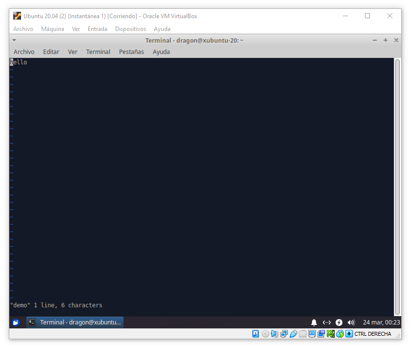
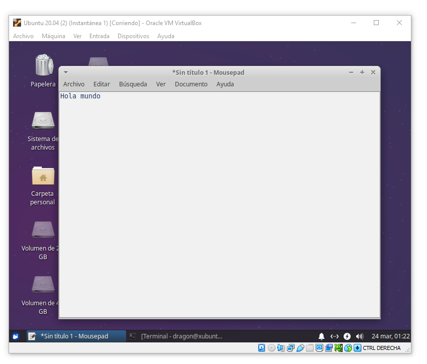
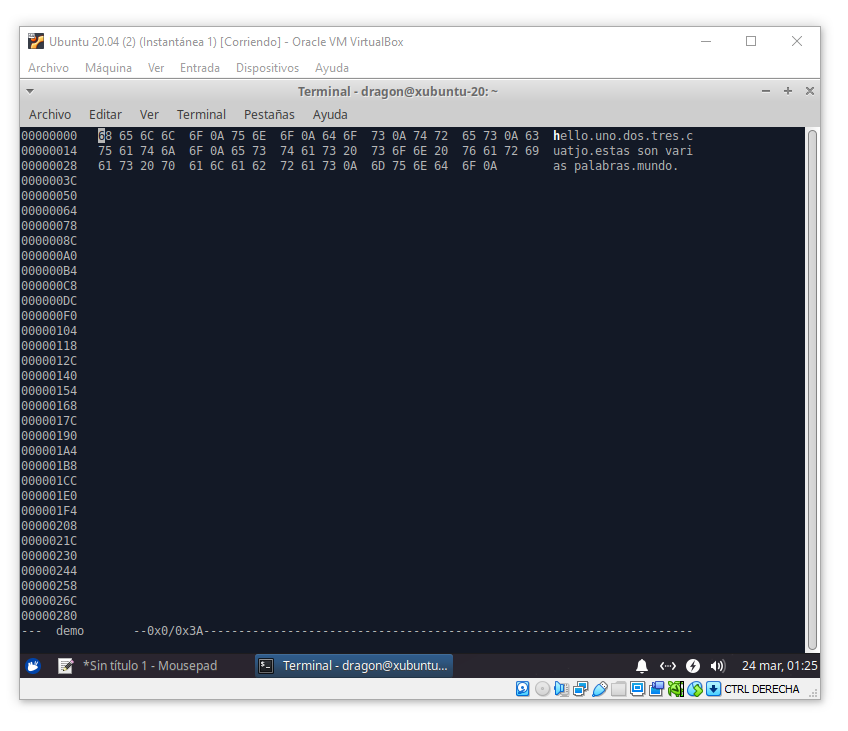
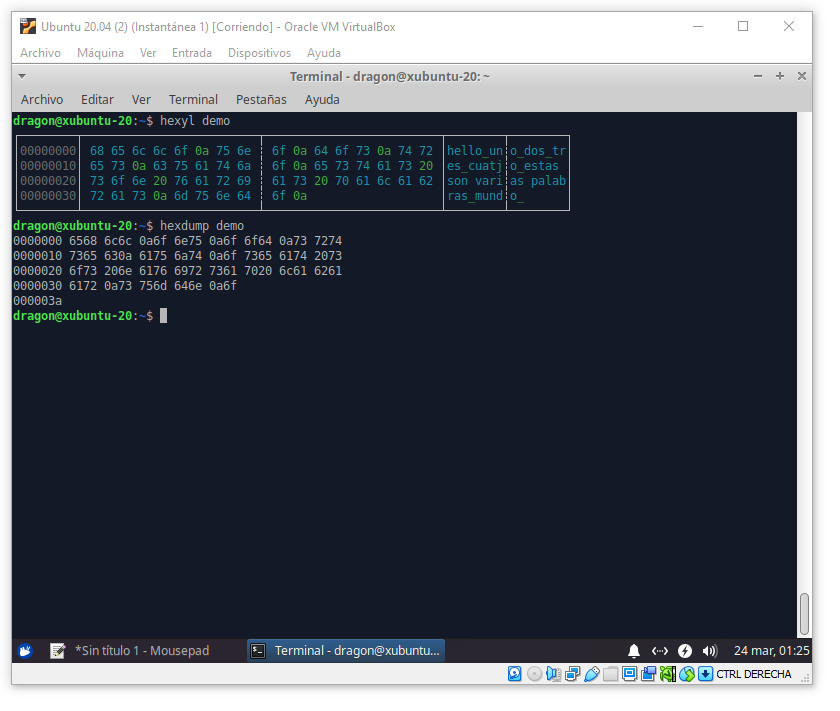

# Editor Vi

---

## Introducción

El editor de texto **Vi** es usado en el modo de texto para proveer una interfaz de edición de archivos de texto mediante `vi <file>`. Este editor es uno de los más populares y disponible junto a las distribuciones de Linux. Sin embargo, podemos instalar el paquete *Vim* para tener mejores características y soporte mediante `apt install vim`.

    [$] vi <file>
    [$] vim <file>

Posee características avanzadas y lo posiciona sobre editores sencillos como *Nano*, el cuál puede usarse mediante `nano <file>` usando las teclas `[CTRL+<LETRA>]` para realizar operaciones de guardado y salida.

> Ejemplo del editor vi

El editor *Vi* posee tres modos de uso:

* **Modo Comando** - El cuál permite realizar acciones para posicionar el cursos, hacer búsquedas o ejecutar comandos adicionales.
* **Modo Inserción** - En este modo se permite insertar texto manualmente sobre la posición del cursor.
* **Modo Sobreescribir** - En este modo se permite reemplazar el texto manualmente sobre la posición del cursor.

Se puede alternar entre los modos usando las combinaciones de teclas.

En la siguiente tabla se muestra un resumen de las principales combinaciones de teclas usadas por *Vi*.

> Vi Modo Comando

Tecla | Descripción
--- | ---
`i` | Comienza el modo inserción en el cursor actual
`I` | Comienza el modo inserción al principio de la línea en el cursor actual
`a` | Comienza el modo inserción después del cursor actual
`A` | Comienza el modo inserción al final de la línea del cursor actual
`ESC` | Vuelve al modo comando
`u` | Deshace el un cambio
`U` | Deshace todos los cambios sobre la línea actual
`o` | Agrega una nueva línea debajo del cursor actual y entra al modo inserción
`dd` | Elimina la línea del cursor actual
`<n>dd` | Elimina las `<n>` líneas debajo del cursor actual
`D` | Elimina el contenido de la línea después del cursor actual
`C` | Elimina el contenido de la línea después del cursor actual y entra al modo inserción
`dw` | Elimina hasta la siguiente palabra sobre el cursor actual
`<n>dw` | Elimina hasta la siguiente `<n>` palabra sobre el cursor actual
`cw` | Borra la palabra sobre el cursor actual y entra al modo inserción
`x` | Elimina el caracter sobre el cursor actual
`r<c>` | Reemplaza el caracter sobre el cursor actual por el caracter `<c>`
`R` | Entra al modo sobreescribir 
`s` | Borra el caracter del cursor actual y entra al modo insercición
`S` | Borra la línea actual y entra al modo inserción
`~` | Alterna el caracter del cursor actual de mayúscula a minúscula y viceversa
`ZZ` | Guarda y cierra el archivo

En la siguiente tabla se muestran algunos atajos de teclas para el desplazamiento.

> Vi Modo Comando

Tecla | Descripción
--- | ---
`[<FLECHA>]` | Mueve el cursor actual en dirección de la flecha
`[h]` | Mueve el cursor a la izquierda
`[j]` | Mueve el cursor a abajo
`[k]` | Mueve el cursor a arriba
`[l]` | Mueve el cursor a derecha
`[b]` | Mueve el cursor al principio de la palabra
`[e]` | Mueve el cursor al final de la palabra

En la siguiente tabla se muestran comandos especiales (prefijo `:<command>`) para realizar acciones especiales.

> Vi Modo Comando

Comando | Descripción
--- | ---
`:w` | Guarda el archivo
`:q` | Cierra el archivo (si no ha sido modificado)
`:q!` | Cierra el archivo y descarta los cambios
`:wq` | Guarda y cierra el archivo
`[SHIFT+zz]` | Guarda y cierra el archivo
`:<n>` | Mueve el cursor al principio de la línea `<n>`

En la siguiente tabla se muestran algunos comandos útiles.

> Vi Modo Comando

Comando | Descripción
--- | ---
`yy` | Copia la línea actual del cursor
`<n>yy` | Copia las `<n>` líneas siguientes al cursor
`dd` | Corta la línea del cursor actual
`<n>dd` | Corta las `<n>` líneas debajo del cursor actual
`p` | Pega las líneas copiadas debajo del cursor
`<n>p` | Pega las líneas copiadas debajo del cursor repetidas por `<n>`
`P` | Pega la línea copiada arriba del cursor
`<n>P` | Pega las líneas copiadas arriba del cursor repetidas por `<n>`
`gg` | Mueve el cursor al principio del archivo
`<n>gg` | Muevel el cursor al principio de la línea `<n>`
`G` | Mueve el cursor al principio de la última línea del archivo
`<n>G` | Mueve el cursor al principio de la línea `<n>` del archivo
`"<c><command>` | Guarda un buffer nombrado por el caracter `<c>` y permite copiar (`yy`), cortar (`dd`) o pegar (`p`) dicho buffer

### Búsqueda

En la siguiente tabla se muestran los comandos para entrar al modo búsqueda.

* `[/<patter>]` - Comienza una búsqueda hacía enfrente
* `[?<patter>]` - Comienza una búsqueda hacía atrás

* **Nota:** Pulsa enter después de definir la búsqueda, por ejemplo `/hola -> [ENTER]`, esto entrará en el modo especial de búsqueda. Para cancelar la búsqueda pulsa `[ESC]`

> Vi Modo Comando

Comando | Descripción
--- | ---
`/<pattern>` | Define una búsqueda hacía enfrente (pulsa `[ENTER]` para entrar en el modo búsqueda)
`?<pattern>` | Define una búsqueda hacía atrás (pulsa `[ENTER]` para entrar en el modo búsqueda)
`n` | Dirige el cursor hacía la siguiente ocurrencia
`N` | Dirige el cursor hacía la ocurrencia anterior

## Otros Editores

Existen editores gráficos como el editor de textos integrado en GNOME, KDE o XFCE.

> Ejemplo de un editor de texto gráfico

### Editor Hexadecimal

También podemos instalar el editor en modo gráfico *Hexedit* para editar bytes hexadecimales y *Hexyl* similar a *Hexdump*.

    [#] apt install hexedit

    [#] apt install hexyl

> Ejemplo del editor de hexadecimales *Hexedit*

> Ejemplo del visor de hexadecimales *Hexyl*

---

 Instructor [Alan Badillo Salas](https://github.com/dragonnomada)

Estudié **Matemáticas Aplicadas** en la Universidad Autónoma Metropolitana, posteriormente realicé una Maestría en **Inteligencia Artificial** en el Instituto Politécnico Nacional.

He impartido cursos de Programación Avanzada en múltiples lenguajes de programación, incluyendo *C/C++, C#, Java, Python, Javascript* y plataformas como *Android, IOS, Xamarin, React, Vue, Angular, Node, Express*. Ciencia de Datos en *Minería de Datos, Visualización de Datos, Aprendizaje Automático y Aprendizaje Profundo*. También sobre *Sistemas de administración basados en Linux, Apache, Nignx* y *Bases de Datos SQL y NoSQL* como MySQL, SQL Server y Mongo. Desde hace 7 años en varios instituciones incluyendo el *IPN-CIC, CST, KMMX, The Inventor's House, Auribox*. Para diversos clientes incluyendo al *INEGI, CFE, PGJ, SEMAR, Universidades, Oracle, Intel y Telmex*.

---