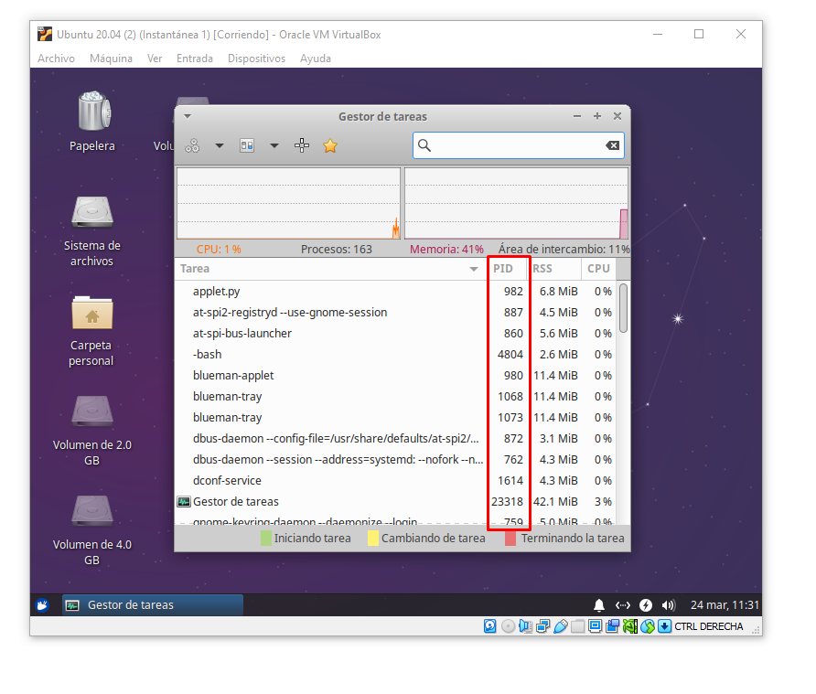

# Permisos Especiales de Archivos

---

## Introducción

Cada proceso ejecutado en el sistema tiene asociado un **PID** o identificador del proceso. Estos pueden consultarse mediante `ps`, `top` y `pstree`.

    [$] ps -ef

    [$] top

Los procesos generalmente pueden ramificarse (`fork`) o desencadenar otros procesos, por lo que generarán un árbol de procesos y podrá ser consultado mediante `pstree`.

    [$] pstree

## Señales

Los procesos tienen un *PID* y mediante este identificador podemos mandarle señales como la señal `-9` para abortar el proceso.

    [$] kill -9 <pid>

## Administradores gráficos

En la siguiente figura se muestra un ejemplo de un administrador gráfico de procesos.

---

 Instructor [Alan Badillo Salas](https://github.com/dragonnomada)

Estudié **Matemáticas Aplicadas** en la Universidad Autónoma Metropolitana, posteriormente realicé una Maestría en **Inteligencia Artificial** en el Instituto Politécnico Nacional.

He impartido cursos de Programación Avanzada en múltiples lenguajes de programación, incluyendo *C/C++, C#, Java, Python, Javascript* y plataformas como *Android, IOS, Xamarin, React, Vue, Angular, Node, Express*. Ciencia de Datos en *Minería de Datos, Visualización de Datos, Aprendizaje Automático y Aprendizaje Profundo*. También sobre *Sistemas de administración basados en Linux, Apache, Nignx* y *Bases de Datos SQL y NoSQL* como MySQL, SQL Server y Mongo. Desde hace 7 años en varios instituciones incluyendo el *IPN-CIC, CST, KMMX, The Inventor's House, Auribox*. Para diversos clientes incluyendo al *INEGI, CFE, PGJ, SEMAR, Universidades, Oracle, Intel y Telmex*.

---