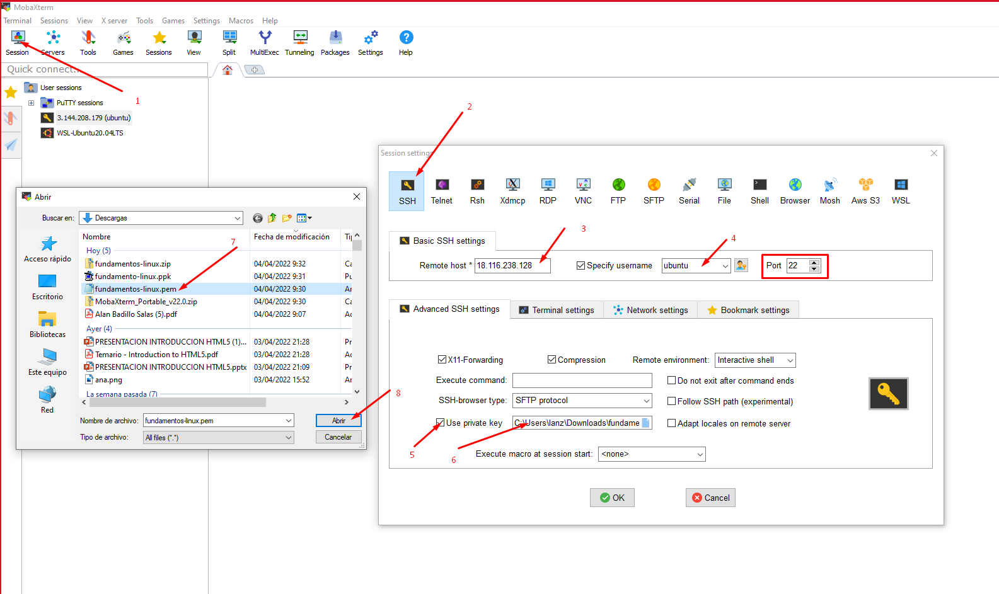
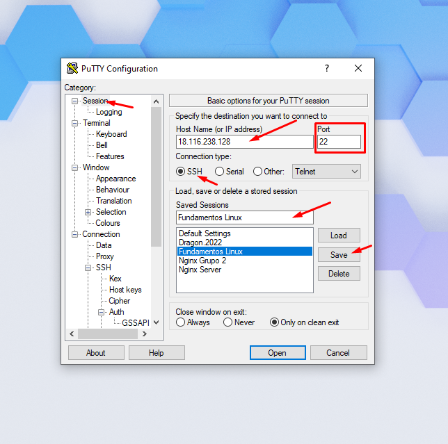
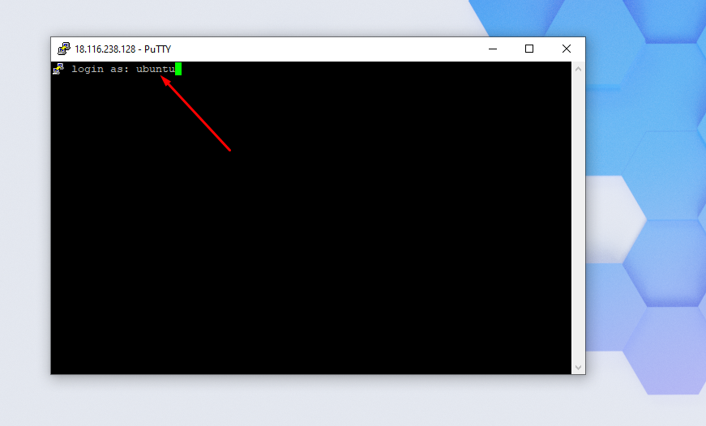
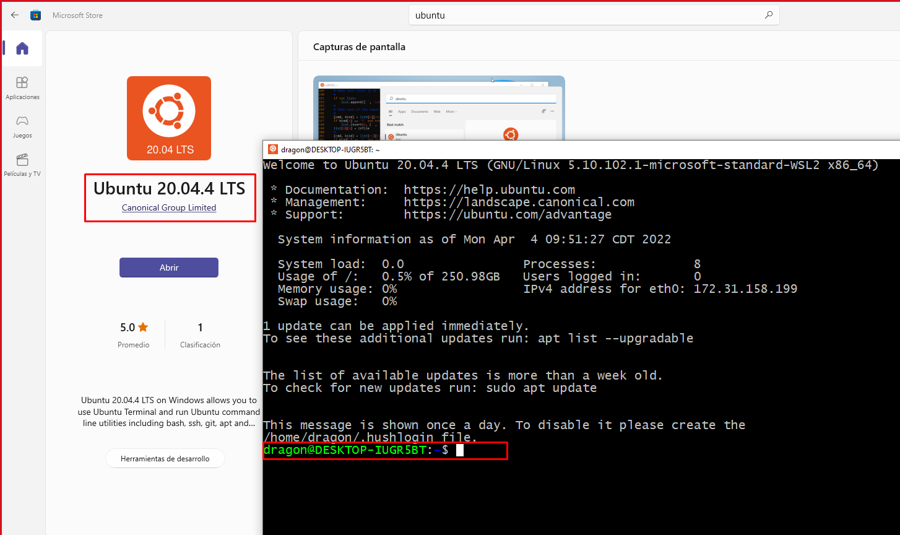
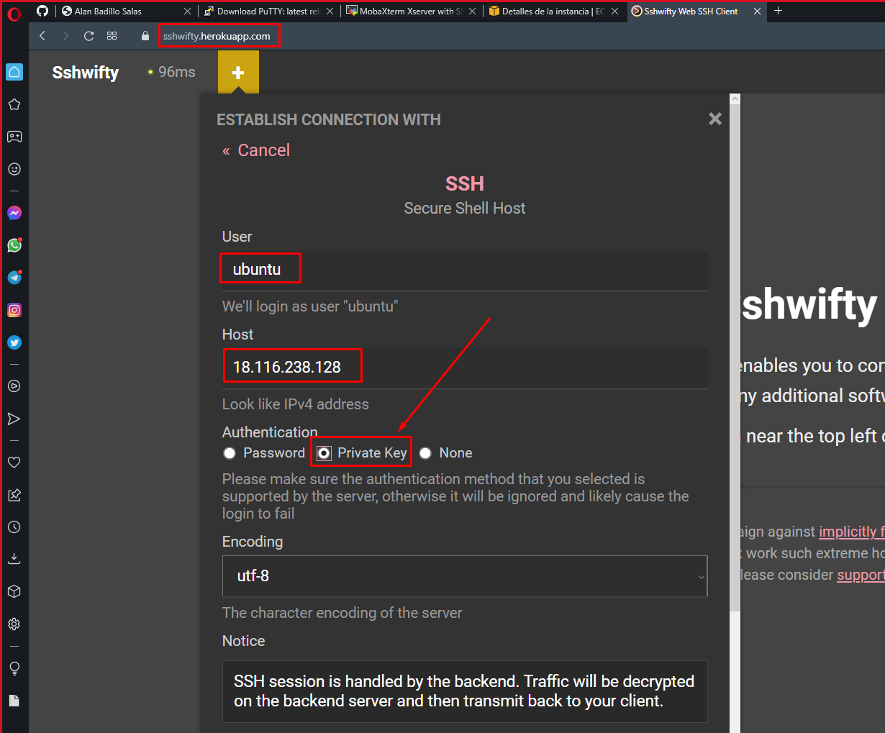
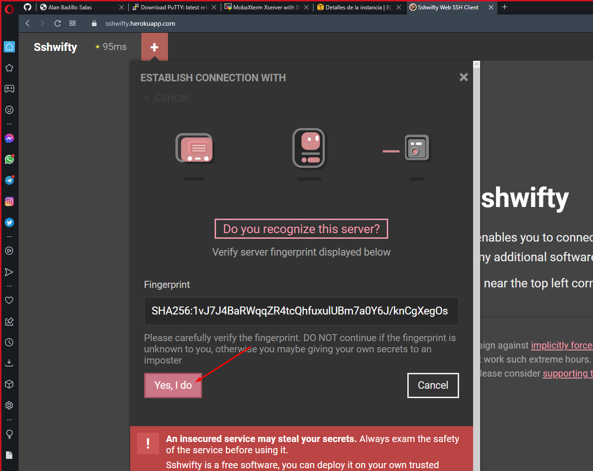
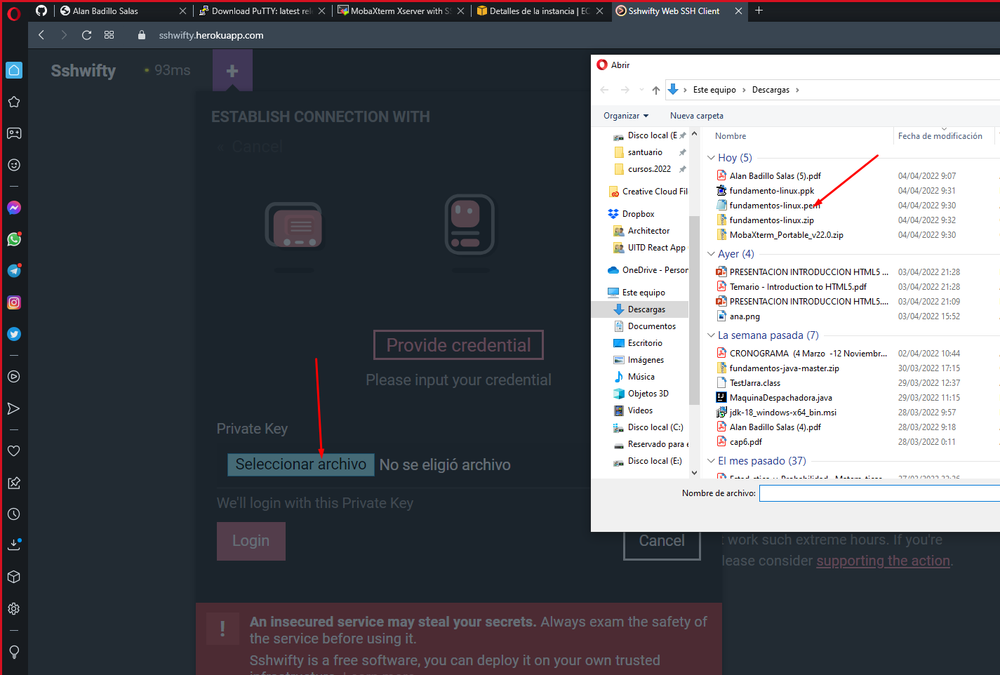

# Guía de Instalación de Linux

---

> Configurar MobaXterm

[https://mobaxterm.mobatek.net/download-home-edition.html](https://mobaxterm.mobatek.net/download-home-edition.html)

> Configurar Putty

[https://www.chiark.greenend.org.uk/~sgtatham/putty/latest.html](https://www.chiark.greenend.org.uk/~sgtatham/putty/latest.html)

> Instalar Ubuntu 20.04 en Windows

[https://www.microsoft.com/store/productId/9MTTCL66CPXJ](https://www.microsoft.com/store/productId/9MTTCL66CPXJ)

> Acceder Mediante Swifty

[https://sshwifty.herokuapp.com](https://sshwifty.herokuapp.com)

